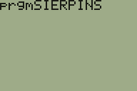

# Calculator programs

## Finding a ROM image

The best way is to copy a ROM image from a physical calculator.

As a last resort, you can download someone else's ROM image, using for instance [TIRoms](https://tiroms.weebly.com/). I reasonably trust this website, although I do not take responsibility for any issue caused by using their ROM images, nor do I encourage people to illegally download intellectual property for free.

## Programs index

Assembly programs (those starting in `AsmPrgm`) can be run using `Asm(`; e.g., calling `Asm(prgmASMBATTE`.

| Program                      | Description                                                                                                                                                                                                                                                                                                                                                                                                  |
|------------------------------|--------------------------------------------------------------------------------------------------------------------------------------------------------------------------------------------------------------------------------------------------------------------------------------------------------------------------------------------------------------------------------------------------------------|
| [ASMBATTE](ASMBATTE.tibasic) | Assembly program to check calculator battery. Returns the battery left in `Ans` (1 is the minimum, 4 the maximum).                                                                                                                                                                                                                                                                                           |
| [CHAOS](CHAOS.tibasic)       | This is an old program and did not seem to be producing anything meaningful, so I changed it to produce a [Sierpinski triangle](https://en.wikipedia.org/wiki/Sierpi%C5%84ski_triangle) using a chaos game. Prompts the number of points/iterations, complexity is linear in the number of iterations; 1000 give a fast but a bit incomplete fractal; 5000 give a decent fractal, but is already a bit slow. |
| [ISPRIME](ISPRIME.tibasic)   | A simple primality test, ends when user presses `ON` key. Uses the simple result that all primes are of the form 6n±1.                                                                                                                                                                                                                                                                                       |
| [JULIA](JULIA.tibasic)       | Plots the [Julia set](https://en.wikipedia.org/wiki/Julia_set). Prompts the number of iterations *M*, the complex parameter *C* and the window boundaries. You can start with *M*=30, *C*=-0.120040+0.747522*i*; the whole Julia set is usually contained in x∈[-1.5, 1.5], y∈[-1, 1]. Takes quite some time.                                                                                                |
| [KOCH](KOCH.tibasic)         | Plots the Koch line, which is the primitive of the [Koch snowflake](https://en.wikipedia.org/wiki/Koch_snowflake). Prompts the number of iterations *I*. Has a complexity of *O*(4^*I*), so *I*=4 is already quite slow, but still reasonable.                                                                                                                                                               |
| [LWERCASE](LWERCASE.tibasic) | Assembly program to activate lowercase letters.                                                                                                                                                                                                                                                                                                                                                              |
| [LANGTON](LANGTON.tibasic)   | Simulates [Langton's ant](https://en.wikipedia.org/wiki/Langton%27s_ant), a machine with very simple rules but very complex behavior.                                                                                                                                                                                                                                                                        |
| [PRIMESIE](PRIMESIE.tibasic) | An implementation of the [sieve of Erathostenes](https://en.wikipedia.org/wiki/Sieve_of_Eratosthenes).                                                                                                                                                                                                                                                                                                       |
| [SIERPINS](SIERPINS.tibasic) | Draws the [Sierpinski triangle](https://en.wikipedia.org/wiki/Sierpi%C5%84ski_triangle) as a curve, using the arrowhead construction method. Prompts the number of iterations *I*. Has a complexity of *O*(3^*I*), so *I*=5 is already quite slow, but still reasonable.                                                                                                                                     |

## Media

| CHAOS | SIERPINS | JULIA |
|-------|----------|-------|
|   |  |   |

| KOCH | LANGTON |
|------|---------|
|   |   |
